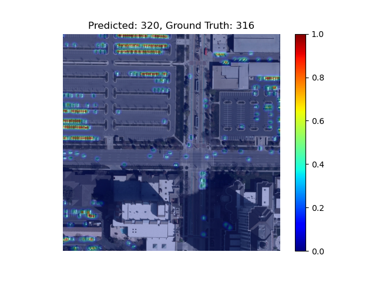
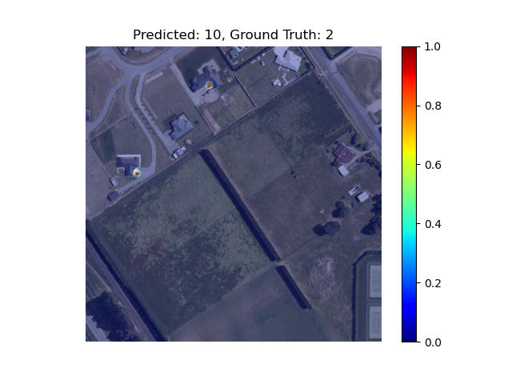
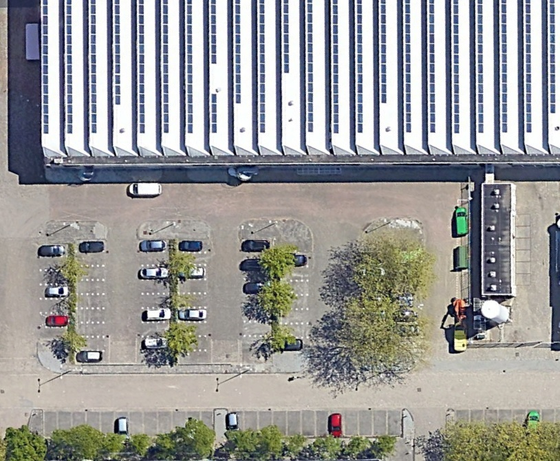
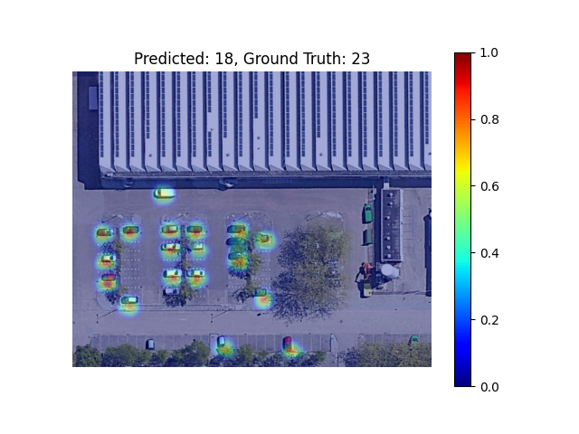
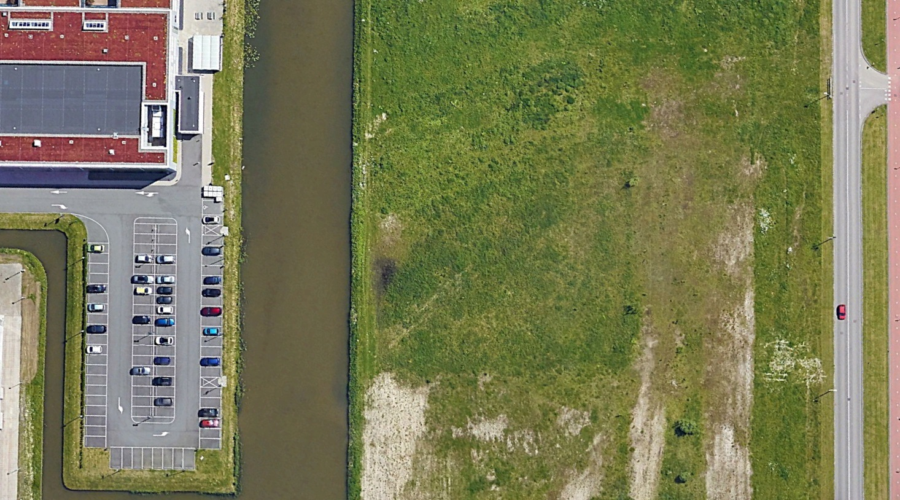
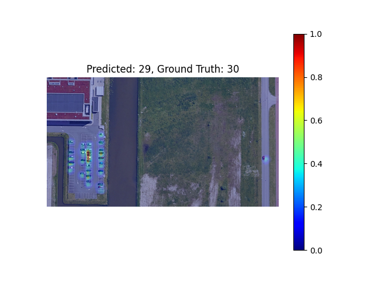
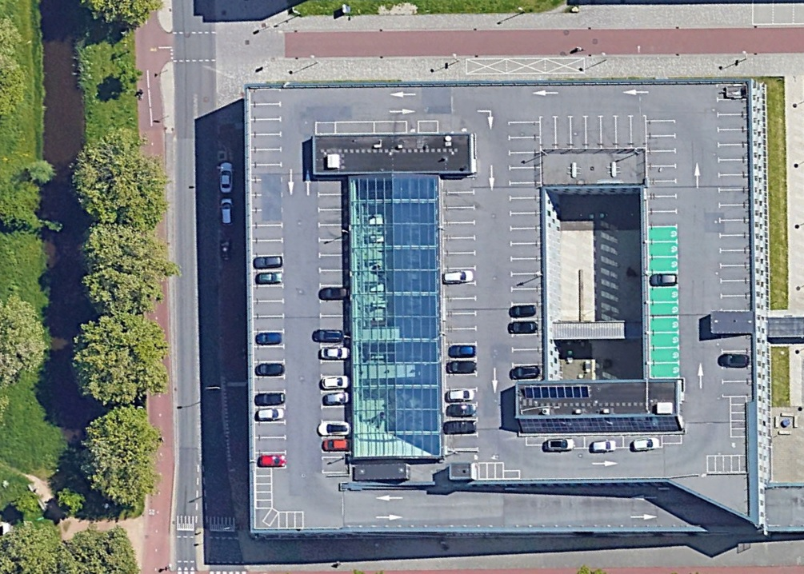
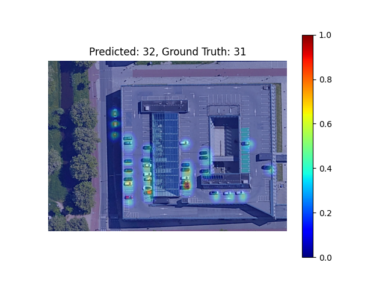

## Guidelines

- https://jvgemert.github.io/writing.pdf

Penalties for Writing (Storyline and blog):

- The text is not stand-alone; it's not peer understandable.
- Using a term before defining/motivating it.
- Unclear logical reasoning step.
- Inconsistent use of terminology.
- Too much unnecessary detail.
- Writing too verbose / full sentences: bullet point should be one-two lines, one sentence, grammar optional
- Too many topics per storyline bullet point
- Too many storyline bullet points.
- Not following my writing guidelines: https://jvgemert.github.io/writing.pdf

Penalties for Content (blog):

- No results, or not enough motivation for why there are no results
- Not enough effort shown
- Results are not explained
- Results are inconsistent and not motivated
- Insufficient "computer vision" alignment
- Unclear why an experiment is done (what question is answered by it, and why is this question interesting)

# Improving car counting with Bayesian Loss
## CS4245, Computer Vision by Deep Learning

  

### Group 13
Authors
- Bhuradia, Mehul (4848969)
- Jaldevik, Albin (5839408)
- Tromp, Marije (4814495)

## Introduction
The need for car counting is prevalent in our modern vehicle-dependent society. There are many different scenarios in
which it is important to know how many vehicles are in a certain area. Some of these include parking optimization,
reducing congestion, and enhancing security. However, with the number the vast number of cars in the world, it is not feasible
to do this by hand. Instead, we can use overhead imagery.

Overhead imagery provides a comprehensive and non-intrusive method for car counting. Using overhead images for this purpose
is not a novel idea. An example of a method that uses these images is presented by Mundhenk et al. (2016). Their best-performing method uses Residual Learning with Inception, called ResCeption, and is trained on 256x256 patches of larger images. Their approach takes in an image and gives the number of cars as output. To count cars in a larger image they had to divide it into patches, using a softmax with 64 outputs. This, therefore, means that
each patch can have a maximum of 64 cars in it.
The authors trained and tested their method on a large publicly available set of overhead images containing cars called Cars Overhead with Context (COWC) that they created themselves.
We use this same dataset for our project.

Another example of a method that uses the COWC dataset is presented by Douillard (2018), who used the dataset for the NATO Innovation Challenge. Their team used RetinaNet (Lin et al, 2017), which is a single-stage architecture, to create
a bounding box for each car in an image. If one wanted to count the number of cars in the image the only added step necessary would be to count the number of bounding boxes. This method was improved upon by Stuparu et al. (2020).
Other methods that count cars on different datasets include but are not limited to Froidevaux et al. (2020) who investigate 2 existing architectures and Liao et al. (2023) who present a new method for counting objects at a specific location.

There are a few problems with the current methods. They use large networks, thus making them difficult to train with limited resources.
Their frameworks are often intricate to allow for good performance and are therefore likely task-specific. Some require multiple types of data of the same location,
or they can't take in large images and have to instead divide the image in patches. The latter can lead to counting errors when the car is divided over 2 or more patches.
Lastly, some also need tricks to be able to work. An example is the limiting of the maximum number of cars in a single patch to 64 as we mentioned earlier.

In this project, we use a different approach to car counting from overhead images, namely Bayesian Loss (BL) as presented by Ma et al. (2019). The authors created BL as an alternative to the most common method for crowd counting, namely density map estimation. They state that using density maps ground-truth is very
susceptible to errors because of many reasons, for example, occlusions. The authors explain that BL converts the point annotations into a density contribution
probability model, using the annotations as priors instead of ground truth. According to them, this mitigates the mentioned problems.
In their paper, the BL looks as follows:
$$\mathcal{L}^{\text{Bayes}} = \sum^{N}_{n=1}\mathcal{F}(1- E[c_n]),$$

where F is a distance function, N is the number of point annotations, and E[cn] is the sum of the posterior probabilities multiplied by the estimated density map. The authors also purpose a modification to the loss function that makes it handle patches with background pixels better. This function is called Bayes+ and looks as follows:

$$\mathcal{L}^{\text{Bayes+}} = \sum^{N}_{n=1}\mathcal{F}(1- E[c_n]) + \mathcal{F}(0- E[c_0]),$$

where $E[c_0]$ is the background count.

They show that BL can reach state-of-the-art performance with only a simple network. We apply BL to the COWC dataset. To do this we use the code made publicly available by Ma et al. (2019).

## Method
To apply BL to the car counting task we used the publicly available codebase from Ma et al. (2019), which contains the code for all steps necessary to
train and test a model that can count cars in images. Their code uses the VGG-19 network and includes support for the 2 different
image datasets they used in their paper.

During preprocessing their code calculates the mean distance to the closest three annotations to try and measure how big the
object is. During training, this value is clipped to a value that could realistically make sense, which is the main difference between the support for the 2 different classes.

In this project, we used the new COWC dataset instead of these 2 classes. We trained models using the support for both datasets using
VGG-19, a version of one of the supports using different clip values that could make more sense for the COWC dataset, and
the combination of one of the supports and AlexNet instead of VGG-19. To be able to quantify the results of our experiments we also investigated using VGG-19 with Mean Squared Error (MSE) loss as a baseline.

The Mean Squared Error baseline adaptation was constructed by applying an additional fully connected layer to the end of the standard VGG-19 network to directly estimate the number of cars in a scene. The MSE loss was then calculated between the estimated number of cars and the ground truth number of cars. It is important to note that the MSE network is trained on only the number of cars in the patches while the BL networks also train on the exact position of the cars in the patches.

## Results
After applying Bayesian Loss (BL) to the car counting task using the VGG-19 network, we conducted experiments on the Cars Overhead with Context (COWC) dataset. We compared our results with the baseline model using Mean Squared Error (MSE) loss. Additionally, we trained models using different clip values that could better suit the characteristics of the COWC dataset. We also explored the combination of one of the supports with AlexNet instead of VGG-19. In this section, we present the performance metrics obtained from these experiments and analyze the effectiveness of BL in achieving accurate car counting results.

The table below presents the performance metrics obtained from the 3 main experiments conducted on the COWC dataset using different models and loss functions. The metrics included were influenced by the scene counting metrics from the original COWC paper as well as our personal judgment of what is important.

| Model            | MSE    | MAE    | MAE (%) | Max[MAE] (%) | Predicted Total | Total Error |
|------------------|--------|--------|---------|--------------------------|-----------------|-------------|
| MSE (baseline)   | 32.99  | 23.41  | 105.14  | 1703.52                  | 8991            | 932         |
| BL               | **9.56**   | 7.14   | 95.89   | 840.27                   | 8449            | **390**         |
| **BL+**              | 10.55  | **5.78**   | **13.68**   | **278.85**                   | 7646            | -413        |

All models use VGG-19 as backbone and the same data loader and dataset. The test sets consist of 83 images with a total of 8059 cars (~97 cars / image). The MSE model uses MSE as loss function, BL uses Bayesian Loss, and BL+ uses Bayesian Loss with background count. The best results are highlighted in bold.

### Baysian Loss vs Mean Squared Error
The results show that the BL model outperforms the MSE model in essentially all metrics, especially, MSE and MAE. This is in line with our expectations.

It is important to note that while a direct comparison between the performances of the two models is possible, it may not be the most fair. The MSE model is trained on only the number of cars in the patches while the BL model also trains on the exact position of the cars in the patches. This means that the BL model has more information to train on and should be able to achieve better results. However, since the MSE model uses a linear layer at the end, it is not as flexible with the size of the input images as the one used in the BL model. The ability to adapt to different patch sizes is one of the main benefits of the BL model.

### VGG-19 with Bayesian Loss
The best results were achieved when using BL and taking the background into account (Bayes+). When inspecting the results closer, we found that some of the configurations struggle with scenes where there are very few cars in particular. These scenes have a large proportion of background and the model that does not take this into account inherently struggles.

The following images are examples of how the model operates on different scenes. We have here overlayed the probability density map over the original image for better interpretation.

#### Bayesian Loss
We can observe that the default Bayesian loss performs relatively well on images with many cars, but struggles with images with few cars. This is because the model does not take the background into account, and therefore struggles with scenes with a large proportion of background.

    
    

#### Bayesian Loss with background count (Bayes+)
The Bayes+ model performs well on both images with many cars and images with few cars. This is because the model takes the background into account, and therefore also performs well on scenes with a large proportion of background. This is also supported by the fact that absolute MSE and MAE values are very similar for the two models but for percentage errors, the difference is clear. We believe this is the main reason why the Bayes+ model on average performs better than the default Bayes model.

    
    

### Generalization
The generalization of the model was evaluated using aerial images obtained from Google Earth of the TU Delft campus. We selected the three images for this.

    
    

Image: Google ©2022 Landsat/Copernicus

We selected this first image because in the right half of the image, it includes a few cars that are almost entirely covered by trees.
These cars are barely visible in the image, so, therefore, we did not include them in the ground truth, but we were curious if the model would be able
to recognize them.

In the right image, we can see that the model was not able to recognize the cars that were covered by the trees, as we expected. It also missed 5 cars that we did count.
Most of the cars that it missed were partially covered by trees, which is most likely the reason that they were not counted. The only car that was not
covered is the green one on the upper right.

    
    

Image: Google ©2022 Landsat/Copernicus

We selected the second image because a small part of the image is relatively densely packed with cars, there is a large empty space,
and there is a single car on a road. Therefore this image is able to show how the model performs on both dense and sparse areas. As we can see in the
right image the models' prediction is only 1 off of the actual ground truth. It is able to recognize both the dense and sparse areas.

    
    

Image: Google ©2022 Landsat/Copernicus

We selected the third image because most of the image is relatively easy to count, but it does include a small strip of shadows in which 3 cars are located.
One of these cars is black and therefore almost invisible in the shadow. It also includes a small cart. This image is therefore able
to test how well the model can recognize cars while also not highlighting other objects.

As we can see in the right image the model is again almost spot on with its prediction. It predicts there to be one more car than there actually is, but it was able
to highlight the black car in the shadow while also not highlighting the cart in the right upper corner.

Remarkably, the model performed exceptionally well in accurately counting cars in these images. The accompanying density maps visually depict the distribution of cars within the campus, while the model's predicted car count provides a quantitative estimation. The density maps demonstrate that the model successfully captures the areas with higher car density, aligning closely with the ground truth counts. This outcome indicates that the model can effectively generalize its car counting capability to new and diverse aerial images, showcasing its robustness and versatility in different contexts.

## Conclusion
In conclusion, the utilization of Bayesian Loss (BL) in the VGG-19 model significantly improves its performance in car counting tasks. BL consistently outperformed the traditional Mean Squared Error (MSE) loss function, demonstrating superior accuracy, precision, and percentage error metrics. Moreover, the model showcased impressive generalization capabilities, successfully counting cars in overhead images obtained from various sources, including the TU Delft campus on Google Earth. This ability to generalize to different overhead images highlights the model's adaptability and effectiveness in real-world scenarios. By leveraging BL and its robust generalization, we have laid a solid foundation for accurate and efficient car counting in diverse environments, opening doors to a wide range of applications such as parking optimization, congestion management, and enhanced security.
Additionally, it is worth noting that the model's performance is particularly impressive when dealing with images containing a significant number of cars. In such cases, the model consistently achieves higher accuracy and lower error rates. However, it is important to acknowledge that the model's performance tends to degrade when confronted with images depicting a relatively small number of cars, particularly fewer than 10 cars. This limitation suggests the need for further exploration and refinement of the model to enhance its precision in accurately counting sparse car instances.

## References
Douillard, A. (2018, June 21). Detecting cars from aerial imagery for the NATO Innovation Challenge. Arthur Douillard. https://arthurdouillard.com/post/nato-challenge/

Froidevaux, A., Julier, A., Lifschitz, A., Pham, M. T., Dambreville, R., Lefèvre, S., ... & Huynh, T. L. (2020, September). Vehicle detection and counting from VHR satellite images: Efforts and open issues. In IGARSS 2020-2020 IEEE International Geoscience and Remote Sensing Symposium (pp. 256-259). IEEE.

Liao, L., Xiao, J., Yang, Y., Ma, X., Wang, Z., & Satoh, S. I. (2023). High temporal frequency vehicle counting from low-resolution satellite images. ISPRS Journal of Photogrammetry and Remote Sensing, 198, 45-59.

Lin, T. Y., Goyal, P., Girshick, R., He, K., & Dollár, P. (2017). Focal loss for dense object detection. In Proceedings of the IEEE international conference on computer vision (pp. 2980-2988).

Ma, Z., Wei, X., Hong, X., & Gong, Y. (2019). Bayesian loss for crowd count estimation with point supervision. In Proceedings of the IEEE/CVF international conference on computer vision (pp. 6142-6151).

Mundhenk, T. N., Konjevod, G., Sakla, W. A., & Boakye, K. (2016). A large contextual dataset for classification, detection and counting of cars with deep learning. In Computer Vision–ECCV 2016: 14th European Conference, Amsterdam, The Netherlands, October 11-14, 2016, Proceedings, Part III 14 (pp. 785-800). Springer International Publishing.

Stuparu, D.-G., Ciobanu, R.-I., & Dobre, C. (2020). Vehicle Detection in Overhead Satellite Images Using a One-Stage Object Detection Model. Sensors, 20(22), 6485. https://doi.org/10.3390/s20226485

## Appendix A: Code Modifications

We additionally made a bunch of modifications to the official Bayesian Loss for Crowd Count Estimation with Point Supervision implementation. The modifications are spread out over multiple branches in our fork of the repository. Some changes are highlighted below:

- Added support for converting the format of the COWC dataset to the format used by the original implementation.
- Added support for debugging the dataset by inspecting the annotations overlayed on the images.
- Added support for using AlexNet instead of VGG-19.
- Modified the model to support direct count regression instead of density map estimation.
- Added support for training on Mac GPUs (MPS) instead of only CUDA GPUs.
- Added support for testing .tar checkpoint files and not only .pth files.
- Added the option to output the density map images for the test set.
- Added additional metrics for model evaluation.

## Appendix B: Additional Experiments
We also ran some additional experiments that are not included in the report. These experiments are listed below:
- We retrained the original Bayesian Loss model for 600 epochs on the crowd-counting UCF-QNRF dataset. The training took about 12 h. On the testing set, the model achieved mean absolute error of 91.5 and mean squared error 168.8 compared to the original paper's results of 88.7, and 154.8 respectively. The results are almost as good as the original paper and the difference is likely due to the fact that we trained for 600 epochs instead of 1000 epochs.
- TODO: Data Loaders?
| VGG-19 (with BL) | Modified data loader | 13.69 | 6.38   | 47.67   | 7923.85        | 8059              | 513.87                   | -135.16     | 83               |
