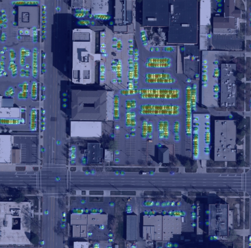

## Guidelines

- https://jvgemert.github.io/writing.pdf

Penalties for Writing (Storyline and blog):

- The text is not stand-alone; it's not peer understandable.
- Using a term before defining/motivating it.
- Unclear logical reasoning step.
- Inconsistent use of terminology.
- Too much unnecessary detail.
- Writing too verbose / full sentences: bullet point should be one-two lines, one sentence, grammar optional
- Too many topics per storyline bullet point
- Too many storyline bullet points.
- Not following my writing guidelines: https://jvgemert.github.io/writing.pdf

Penalties for Content (blog):

- No results, or not enough motivation for why there are no results
- Not enough effort shown
- Results are not explained
- Results are inconsistent and not motivated
- Insufficient "computer vision" alignment
- Unclear why an experiment is done (what question is answered by it, and why is this question interesting)

# Improving car counting with Bayesian Loss
## CS4245, Computer Vision by Deep Learning

  

### Group 13
Authors
- Bhuradia, Mehul (4848969)
- Jaldevik, Albin (5839408)
- Tromp, Marije (4814495)

## Introduction
The need for car counting is prevalent in our modern vehicle dependent society. There are many different scenarios in
which it is important to know how many vehicles are in a certain area. Some of these include parking optimization,
reducing congestion, and enhancing security. However, with the number the vast number of cars in the world it is not feasible
to do this by hand. Instead we can use overhead imagery.

Overhead imagery provides a comprehensive and non-intrusive method for car counting. Using overhead images for this purpose
is not a novel idea. An example of a method that uses these images is presented by Mundhenk et al. (2016). Their best performing method
uses Residual Learning with Inception, called ResCeption, and is trained on 256x256 patches of larger images. Their approach takes in an
image and gives the number of cars as output. To count cars in a larger image they had to divide it in patches, using a softmax with 64 outputs. This therefore means that
each patch can have a maximum of 64 cars in it.
The authors trained and tested their method on a large publicly available set of overhead images containing cars called Cars Overhead with Context (COWC) that they created themselves.
We use this same dataset for our project.

Another example of a method that uses the COWC dataset is presented by Douillard (2018), who used the dataset for the NATO Innovation Challenge. Their team used RetinaNet (Lin et al, 2017), which is a single-stage architecture, to create
a bounding box for each car in an image. If one wanted to count the number of cars in the image the only added step necessary would be to count the number of bounding boxes. This method was improved upon by Stuparu et al. (2020).
Other methods that count cars on different datasets include but are not limited to Froidevaux et al. (2020) who investigate 2 existing architectures and Liao et al. (2023) who present a new method for counting objects at a specific location.

There are a few problems with the current methods. They use large networks, thus making them difficult to train with limited resources.
Their frameworks are often intricate to allow for good performance, and are therefore likely task specific. Some require multiple types of data of the same location,
or they can't take in large images and have to instead divide the image in patches. The latter can lead to counting errors when the car is divided over 2 or more patches.
Lastly some also need tricks to be able to work. An example is the limiting of the maximum number of cars in a single patch to 64, like we mentioned earlier.

In this project we use a different approach to car counting from overhead images, namely Bayesian Loss (BL) as presented by Ma et al. (2019). The authors created BL as an alternative to
to the most common method for crowd counting, namely density map estimation. They state that using density maps ground-truth is very
susceptible to errors because of many reasons, for example occlusions. The authors explain that BL converts the point annotations into a density contribution
probability model, using the annotations as priors instead of ground-truth. According to them this mitigates the mentioned problems.
In their paper they show that since the BL looks as follows:
$$\mathcal{L}^{\text{Bayes}} = \sum^{N}_{n=1}\mathcal{F}(1- E[c_n])$$

where F is a distance function, N is the number of point annotations, and E[cn] is the sum of the posterior probabilities multiplied with the estimated density map.
They show that BL is able to reach state-of-the-art performance with only a simple network. We apply BL to the COWC dataset. To do this we use the code made publicly available by Ma et al. (2019).

## Method
To apply BL to the car counting task we used the publicly available codebase from Ma et al. (2019), which contains the code for all steps necessary to
train and test a model that can count cars in images. Their code uses the VGG-19 network and includes support for the 2 different
image datasets they used in their paper.

During preprocessing their code calculates the mean distance to the closest three annotation to try and measure how big the
object is. During training this value is clipped to a value that could realistically make sense, which is a main difference
between the support for the 2 different classes.

In this project we used the new COWC dataset instead of these 2 classes. We trained models using the support for both datasets using
VGG-19, a version of one of the supports using different clip values that could make more sense for the COWC dataset, and
the combination of one of the supports and AlexNet instead of VGG-19. To be able to quantify the results of our experiments we used VGG-19 with Mean Squared Error (MSE) loss as a baseline.

## Results
- Combined results and discussion
Result from standard BL with VGG-19 and crowd_sh loader
Good:

Bad:

Total res
mse: 13.68982433593867, mae: 6.3752776312540815, mape: 47.67265583016418 %, predicted_cars: 7923.844641447067, ground_truth_cars: 8059,
max_precentage_error: 513.8685703277588 %, total_error: -135.15535855293274, number_of_images: 83

### Problems

### Data Loaders

### Networks

### Generalization

## Conclusion
- Shorter conclusion

## References
Douillard, A. (2018, June 21). Detecting cars from aerial imagery for the NATO Innovation Challenge. Arthur Douillard. https://arthurdouillard.com/post/nato-challenge/

Froidevaux, A., Julier, A., Lifschitz, A., Pham, M. T., Dambreville, R., Lefèvre, S., ... & Huynh, T. L. (2020, September). Vehicle detection and counting from VHR satellite images: Efforts and open issues. In IGARSS 2020-2020 IEEE International Geoscience and Remote Sensing Symposium (pp. 256-259). IEEE.

Liao, L., Xiao, J., Yang, Y., Ma, X., Wang, Z., & Satoh, S. I. (2023). High temporal frequency vehicle counting from low-resolution satellite images. ISPRS Journal of Photogrammetry and Remote Sensing, 198, 45-59.

Lin, T. Y., Goyal, P., Girshick, R., He, K., & Dollár, P. (2017). Focal loss for dense object detection. In Proceedings of the IEEE international conference on computer vision (pp. 2980-2988).

Ma, Z., Wei, X., Hong, X., & Gong, Y. (2019). Bayesian loss for crowd count estimation with point supervision. In Proceedings of the IEEE/CVF international conference on computer vision (pp. 6142-6151).

Mundhenk, T. N., Konjevod, G., Sakla, W. A., & Boakye, K. (2016). A large contextual dataset for classification, detection and counting of cars with deep learning. In Computer Vision–ECCV 2016: 14th European Conference, Amsterdam, The Netherlands, October 11-14, 2016, Proceedings, Part III 14 (pp. 785-800). Springer International Publishing.

Stuparu, D.-G., Ciobanu, R.-I., & Dobre, C. (2020). Vehicle Detection in Overhead Satellite Images Using a One-Stage Object Detection Model. Sensors, 20(22), 6485. https://doi.org/10.3390/s20226485

## Appendix A: Code Modications

We additionally made a bunch of modifications to the official Bayesian Loss for Crowd Count Estimation with Point Supervision implementation. The modificaitons is spread out over multiple branches in our fork of the repository. Some changes are highlighted below:

- Added support for converting the format of the COWC dataset to the format used by the original implementation.
- Added support for debugging the dataset by inspecting the annotations overlayed on the images.
- Added support for using AlexNet instead of VGG-19.
- Modified the model to support direct count regression instead of density map estimation.
- Added support for training on Mac GPUs (MPS) instead of only CUDA GPUs.
- Added support for testing .tar checkpoint files and not only .pth files.
- Added the option to output the density map images for the test set.
- Added additional metrics for model evaluation.
